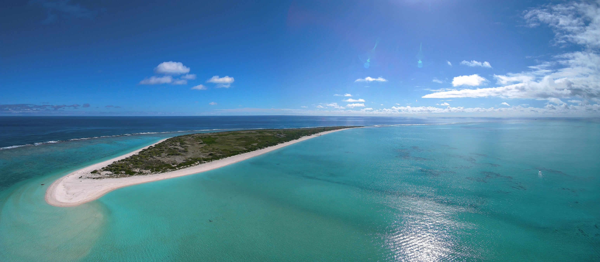

```{r setup, include = FALSE}
knitr::opts_chunk$set(echo = TRUE,
                      message = FALSE, 
                      warning = FALSE)
```

```{r, include = FALSE}
library(tidyverse)
library(here)
library(janitor)
library(grid)
library(sf)
library(ggmap)
library(ggrepel)
library(kableExtra)
library(sjPlot)

```

<figure>



<figcaption>

The Hawaiian archipelago is home to thousands of albatross. The Northwestern Hawaiian islands, Papahanaumokuakea, are comprised of atolls, reefs, and pinnacles, where 95% of all Black-footed albatross and 99% of Laysan albatross nest [@Arata:2009]. These low lying islands that serve as nesting habitat for these seabirds are at high risk of inundation from tsunami events. *Image Credit: Kure Atoll Conservancy*

</figcaption>

</figure>
## Objective


## Analysis Plan

This analysis will follow the specific steps outlined in Table 1 below:

```{r}
data.frame("Phase" = c(1:6),
           "Description" = c("Identify research question",
                             "Collect data",
                             "Visualize data",
                             "Conduct regression analysis",
                             "Interpret results",
                             "Conclusion")) %>% 
  kable(caption = "Table 1: Analysis Plan Outline") %>%
  kable_paper(full_width = FALSE) %>%
  kable_styling(latex_options = "striped",
                font_size = 15) %>% 
  column_spec(1, bold = T) %>%
  row_spec(0, bold = T, color = "black")
```

## Collect Data


```{r band data, include = FALSE}
# read in banding data
albie_band <- read_csv(here("_posts", "2022-01-09-hawaii-albatross-tohoku-tsunami", "data", "laal_bfal_ca_hi_bbl2021.csv")) #both bfal and laal banding data for CA and HI
```

```{r tidy banding data, include = FALSE}
albie_band <- albie_band %>% 
  mutate(species = case_when(
    species_scientific_name == "Phoebastria immutabilis" ~ "LAAL",
    species_scientific_name == "Phoebastria nigripes" ~ "BFAL")) %>% 
  relocate(species, .after = original_band) %>% 
  relocate(species_name, .after = species) %>% 
  relocate(species_scientific_name, .after = species_name) %>% 
  mutate(count = as.numeric("1")) %>% 
  relocate(count, .after = species_scientific_name) %>% 
  mutate(event_date = as.Date(event_date, "%m/%d/%y")) %>% 
  rename(year = event_year) %>% 
  filter(albie_band$iso_subdivision == "US-HI") %>% 
  select(c(-other_bands, -who_obtained_code, -original_band, -event_type))
 
```

```{r}
# convert database to sf element to create geom
albie_sf <- st_as_sf(albie_band, 
                       coords = c("lon_dd","lat_dd"), 
                       crs = 4326)

```

## Visulize Data


```{r create HI map}
# bounding box for Hawaii
hawaii <- c(-178, 18.5, -154, 28.9)

hawaii_map <- get_map(hawaii,
                      source = "google",
                      maptype = "satellite")
```

```{r nwhi points}
nwhi_points <- data.frame(lon = c(-161.9, -164.11, -166.05, -167.99, -170.65, -171.68, -174, -175, -176.5, -177),
                          lat = c(23.06, 22.84, 23.94, 24.99, 24.8, 25.81, 25.6, 26.2, 26.5, 28.8),
                          name = c("Nihoa", "Mokumanamana", "Lalo", "Onunui", "Kamokuokamohoalii", "Kamole", "Kapou", "Manawai", "Kuaihelani", "Holaniku"))

```

```{r create albatross map}
albie_map <- ggmap(hawaii_map) +
  geom_point(aes(x = lon_dd, y = lat_dd, color = species_name),
             data = albie_band,
             size = 0.5,
             alpha = 0.25) +
  scale_color_manual(name = "Albatross species",
                     values = c("#9E7E8C", "#39ACB1"),
                     labels = c("Black-footed Albatross", "Laysan Albatross"),
                     guide = guide_legend(override.aes = list(size = 3, alpha = 1))) +
  geom_label_repel(data = nwhi_points,
                   aes(x = lon, y = lat, label = name),
                   size = 2,
                   vjust = 0.5,
                   hjust = 0.9,
                   alpha = 0.8) +
  labs(title = "Figure 1: Banded Albatross Species in the Hawaiian Archipelago",
        subtitle = "1996 - 2021",
        x = "Longitude",
        y = "Latitude") +
  theme(legend.title = element_text(size=12, color = "black", face="bold"),
           legend.justification=c(0,1), 
           legend.position=c(0.74, 0.95),
           legend.background = element_blank(),
           legend.key = element_blank())

albie_map
 
```

```{r, include = FALSE}
ggsave(here("_posts/2022-01-09-hawaii-albatross-tohoku-tsunami/images/fig1_albatross_map.png"), plot = albie_map)
```

```{r}

band_count <- albie_band %>% 
  group_by(species, year) %>% 
  summarise(total = sum(count))

```

```{r plot count by species, warning=FALSE}
#plot banding count data

albie_count_plot <- ggplot(band_count, aes(x = year, y = total, group = species)) +
  geom_point(aes(color = species,
                 shape = species)) +
  geom_line(aes(color = species)) +
  scale_color_manual(name = "Albatross species",
                     values = c("#9E7E8C", "#39ACB1"),
                     labels = c("Black-footed Albatross (BFAL)", "Laysan Albatross (LAAL)"),
                     guide = guide_legend(override.aes = list(shape = c(19, 17)))) +
  geom_vline(xintercept = 2011,
             linetype = "solid",
             color = "goldenrod1",
             size = 2) +
  guides(shape = FALSE) +
  annotate("text",
           label = "Tōhoku tsunami",
           x = 2014,
           y = 4700,
           color = "black",
           size = 4) +
  labs(title = "Figure 2: Hawaii Albatross Count Based On Band Data",
       subtitle = "Data source: USGS Bird Banding Lab",
       x = "Year",
       y = "Albatross Banded",
       color = "Species") +
  theme_minimal() +
  theme(legend.background = element_blank(),
        legend.position = "bottom")  
  
albie_count_plot
```

```{r, include = FALSE}
ggsave(here("_posts/2022-01-09-hawaii-albatross-tohoku-tsunami/images/fig2_species_count_plot.png"),
       plot = albie_count_plot,
       width = 6,
       height = 4,
       units = "in",
       bg = "white",
       dpi = "print")
```

```{r}
# create new column for year pre-tsunami (0) and post(1), 2011 = post since the tsuanmi occurred before banding season began
band_count <- band_count %>% 
  mutate(t_event = case_when(
    year <= "2010" ~ "0",
    year >= "2011" ~ "1")) 

band_count$t_event <- as.factor(band_count$t_event)
```

```{r two species dfs}
# create two band count dataframes based on species
bfal_count <- split(band_count, band_count$species)[[1]]
laal_count <- split(band_count, band_count$species)[[2]]
```

```{r, include = FALSE}
# explore population data 1996 - 2021

bfal_mean <- round(mean(bfal_count$total), 2)
bfal_min <- round(min(bfal_count$total), 2)
bfal_max <- round(max(bfal_count$total), 2)

laal_mean <- round(mean(laal_count$total), 2)
laal_min <- round(min(laal_count$total), 2)
laal_max <- round(max(laal_count$total), 2)

```

```{r}
# table with mean, min, max for both albatross species

bfal_pop_params <- bfal_count %>% 
  summarise(mean = mean(bfal_count$total),
            med = median(bfal_count$total),
            max = max(bfal_count$total))

laal_pop_params <- laal_count %>% 
  summarise(mean = mean(laal_count$total),
            med = median(laal_count$total),
            max = max(laal_count$total))

```

```{r pop params summary df, include = FALSE}
#combine the two population params data sets with bind_rows

pop_params_summary <- bind_rows(bfal_pop_params, laal_pop_params) 

```

```{r}
pop_params_table <- knitr::kable(pop_params_summary,
                                 digits = 0,
                                 col.names = c('Albatross Species', 'Population Mean', 'Population Median', 'Population Max'),
                                 align = "lccc",
                                 caption = "Table 2: Hawaii Albatross Population Summary 1996 - 2021") %>%
  kable_paper(full_width = FALSE) %>%
  kable_styling(latex_options = "striped",
                font_size = 15) %>% 
  column_spec(1, bold = T) %>%
  row_spec(0, bold = T, color = "black") #%>% 
  # save_kable(here("images/pop_params.png"))

pop_params_table 
```

```{r, include = FALSE}
# filter species by pre and post tsunami event
bfal_pre <- bfal_count %>% 
  filter(year %in% c(2002:2010))

bfal_post <- bfal_count %>% 
  filter(year %in% c(2011:2020))

laal_pre <- laal_count %>% 
  filter(year %in% c(2002:2010))

laal_post <- laal_count%>% 
  filter(year %in% c(2011:2020))

```

```{r, include = FALSE}
# mean population of species pre and post tsunami event

mean_pre_bfal <- round(mean(bfal_pre$total), 2)
mean_post_bfal <- round(mean(bfal_post$total), 2)

mean_pre_laal <- round(mean(laal_pre$total), 2)
mean_post_laal <- round(mean(laal_post$total), 2)

```

```{r, include = FALSE}
pop_mean <- tibble(species = c("BFAL", "LAAL"),
                   mean_pre = c(mean_pre_bfal, mean_pre_laal),
                   mean_post = c(mean_post_bfal, mean_post_laal))
```

```{r}
pop_mean_table <- knitr::kable(pop_mean,
                               col.names = c('Species', 'Pre_Pop_Mean', 'Post_Pop_Mean'),
                               caption = "Table 3: Hawaii Albatross Count Means Pre- & Post- Tōhoku Tsunami") %>% 
  kable_classic(full_width = F, html_font = "Cambria") #%>% 
  # save_kable(file = "images/albie_mean_pops.png",
  #            zoom = 1.5)
```

```{r}
pop_mean_table
```

```{r, include = FALSE}
# save mean population data 
#write.csv(pop_mean, file = file.choose(new = T))

```

## Conduct Regression Analysis 

```{r}
bfal_qqplot <- ggplot(bfal_count) +
  geom_qq(aes(sample = total),
          color = "#9E7E8C",
          size = 3) +
  geom_qq_line(aes(sample = total),
            color = "grey") +
  xlab("Normal distribution quantiles") +
  ylab("Sample quantiles") +
  labs(title = "Figure 3: Black-footed Albatross (BFAL) QQ Plot") +
  theme_minimal() +
  theme(line = element_blank(),
        panel.grid = element_blank(),
        strip.text = element_blank(),
        axis.text.x = element_text(size = 10),
        axis.text.y = element_text(size = 10),
        legend.position = "none")
bfal_qqplot  
  
```

```{r, include=FALSE}
ggsave(here("_posts/2022-01-09-hawaii-albatross-tohoku-tsunami/images/fig3_bfal_qqplot.png"),
       width = 4,
       height = 4,
       units = "in",
       bg = "white",
       dpi = "print")
```

```{r}
laal_qqplot <- ggplot(laal_count) +
  geom_qq(aes(sample = total),
          color = "#39ACB1",
          shape = 17,
          size = 3) +
  geom_qq_line(aes(sample = total),
            color = "grey") +
  xlab("Normal distribution quantiles") +
  ylab("Sample quantiles") +
  labs(title = "Figure 4: Laysan Albatross (LAAL) QQ Plot") +
  theme_minimal() +
  theme(line = element_blank(),
        panel.grid = element_blank(),
        strip.text = element_blank(),
        axis.text.x = element_text(size = 10),
        axis.text.y = element_text(size = 10),
        legend.position = "none")
laal_qqplot  
```

```{r, include=FALSE}
ggsave(here("_posts/2022-01-09-hawaii-albatross-tohoku-tsunami/images/fig4_laal_qqplot.png"),
       width = 4,
       height = 4,
       units = "in",
       bg = "white",
       dpi = "print")
```


$$ \text{Albatross count}_i = \beta_0 + \beta_1 \text{tsunami event}  + \varepsilon_i $$ 

```{r}
post_tsunami_simple_mod <- lm(total ~ t_event, data = band_count) %>%
  summary()
```

```{r}
tab_model(post_tsunami_simple_mod ,
          pred.labels = c("Intercept (mean albatross count pre-tsunami)", "Avg. banded albatross count post-tsunami"),
          string.ci = "Conf. Int (95%)",
          string.p = "P-value",
          title = "Table 4: Simple Linear Regression Model for Banded Albatross in Hawaii",
          digits = 4)
```

$$ \text{Albatross count}_i = \beta_0 + \beta_1 \text{tsunami event} + \beta_2 \text{albatross species} + \beta_3\text{tsunami event:species} + \varepsilon_i $$

```{r}
# interaction
interaction_model <- lm(total ~ t_event + species + t_event:species, data = band_count) %>% 
  summary()

```

```{r}
tab_model(interaction_model,
          pred.labels = c("Intercept (mean BFAL count pre-tsunami)", "Mean BFAL count post-tsunami", "Mean LAAL count pre-tsunami", "Mean LAAL count compared to BFAL count post-tsunami"),
          string.ci = "Conf. Int (95%)",
          string.p = "P-value",
          title = "Table 5: Multiple Linear Regression Model Results for Banded Albatross in Hawaii",
          digits = 4)
```

## Interpret Results


## Conclusion


## Corrections {.appendix}

If you see mistakes or want to suggest changes, please [create an issue](https://github.com/juliaparish/juliaparish.github.io/issues) on the source repository.

## Source Code {.appendix}

Find the source code for this blog post [here](https://github.com/juliaparish/eds222_final).

## References {.appendix}

